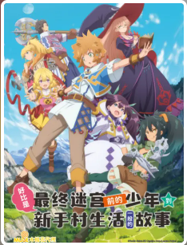
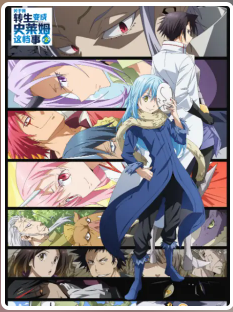
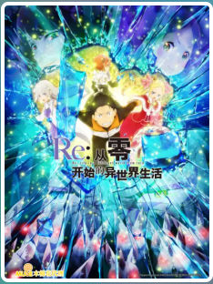
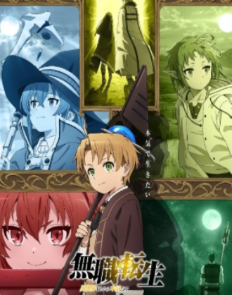
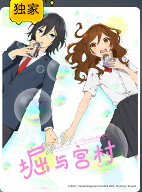

# 1. 前言
之后此类文章将在这里，也就是自己的博客更新，之前简评在[简书](https://www.jianshu.com/c/81e01366c389)上。
主要是对当季度看过的新番和在此时段补的老番进行简略评论和推荐。纯主观看法，不接受异议。
根据看完后编写的时间排序

<!-- more -->

# 2. 新番
## 好比是最终迷宫前的少年到新手村生活一般的故事

[B站链接](https://www.bilibili.com/bangumi/media/md28231833/?spm_id_from=666.25.b_6d656469615f6d6f64756c65.1)
无厘头搞笑异世界番剧，质量中等，仅作为喜剧看的话勉强及格，仅推荐给片荒且对此题材有兴趣的朋友。

## 关于我转生变成史莱姆这档事 第二季 

第一季没看完，看了一半弃了，听说第二季要比第一季黑暗些，于是直接看，有个超长的前情提要，跳着看也没啥问题。
结论嘛，就是受众可能不是我这个年龄层的，情节都非常的尬，用着快进看完，的确不是我所好，完全不明白为啥高人气，脸谱化严重的反派，情感单调的配角，迷惑的行为动机等，可能还是我的岁数已经偏离主要看动漫人群的平均年龄，无法理解其中的优点。所以，不推荐。

## Re：从零开始的异世界生活 第二季 后半

[B站链接](https://www.bilibili.com/bangumi/media/md28232073/?spm_id_from=666.25.b_6d656469615f6d6f64756c65.1)
追了小说，追了漫画，当然也看了动画。天花板级别的异世界番剧，没有短板，无差别推荐。这一季真的是补完了各个配角的故事，让剧中的每一个人都异常丰满，他们的执念，他们的情感波折都非常的闪耀，角色的塑造上，这番剧觉得一流。并且这季每集都是29分钟，长期看不到片头和片尾，毫无水分的内容，非常满足。。。

## 五等分的新娘∬ 

[B站链接](https://www.bilibili.com/bangumi/media/md28231808/?spm_id_from=666.25.b_6d656469615f6d6f64756c65.1)
首先，第二季制作好于第二季。然后，5个妹子依旧非常可爱，最后，推荐给能接受恋爱喜剧题材的所以同志，此番据属同类题材中的上层。

##  只有我能进入的隐藏迷宫
无图，最近辞职了比较闲，于是找了些格外的来看。一句话，仅推荐给能够快进且能不带脑子看番剧的LSP们。

##  回复术士的重启人生 
里番，已经不是LSP的等级了，是LSP MAX，正经人还是别看，会拉低宅男风评。

##  无职转生

由于某事件被B站下架，莫名其妙！看了4集发现突然没了，心态炸裂，真的是基数多了，啥稀奇古怪的生物就蹦出来了。
作品本身制作非常精良，表现力完胜原作，缺点就是剧情不是特别出彩。不过仍然十分推荐给对异世界题材感兴趣的同志。

##  堀与宫村

[B站链接](https://www.bilibili.com/bangumi/media/md28231840/?spm_id_from=666.25.b_6d656469615f6d6f64756c65.1)
青春恋爱喜剧，吧？简单来讲就是狗娘番，但是不怎么和我胃口，推荐力度一般般。

以下是看了部分，如果之后补完有别的看法再修订
##  记录的地平线 圆桌崩坏
完完全全忘记了之前剧情，对新番影响蛮大的，但是记忆告诉我这个番剧是一部好作品。
很难啃，前后关系还是比较大，忘记角色后，就跟不上剧情了。等之后补完再说吧。
##  奇蛋物语
妹子贼萌，制作精良，剧情有点小圆既视感，但目前没发刀，就和前两集的小圆对我没吸引力一样，看了5级的奇蛋物语没看到刀后，也搁置了，主要是太平淡了，没有波折就没有吸引力，我擦，我咋这么M呢 - -|。等之后补完看有啥新看法吧。

# 3. 补番

## 天使降临到我身边

[B站链接](https://www.bilibili.com/bangumi/media/md4316442/?spm_id_from=666.25.b_6d656469615f6d6f64756c65.1)
最近才发现，真猛男番，那真的是太热血了- -|，好吧，前面在瞎说，萌系治愈类型，轻松日常，让猛男一不注意就看完整部的作品，无差别推荐给诸位，我反正对可爱没有免疫力。

## 星掠者/掠夺者
原作的作者挺有名的，所以准备看一看，然而。。。
不推荐，所以不上图。

