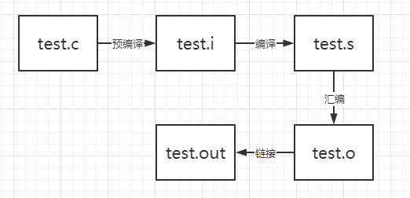
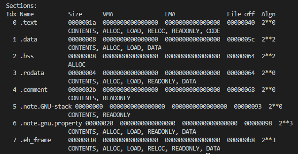
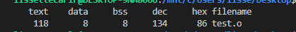

# 1. 前言
本文主要说明使用gcc编译一个hello world程序时的四个步骤，预处理（Prepressiong）、编译（Compilation）、汇编（Assembly）、链接（Linking）。

<!-- more -->

# 2. 预处理

主要是处理源文件中以#开始的预编译指令，经过预编译后的.i文件不包含任何宏定义，所以的宏都被展开。
使用以下例程来测试
```
#define NUMBER_10 10
void main()
{
    int a =NUMBER_10;
}
```
使用gcc -E命令生成.i文件
```
gcc -E test.c -o test.i
```
test.i
```
# 1 "test.c"
# 1 "<built-in>"
# 1 "<command-line>"
# 1 "test.c"

void main()
{
    int a =10;
}
```

# 3. 编译
编译过程是把预处理完毕的文件进行词法分析、语法分析、语义分析及优化后生成相应的汇编文件。

* 词法分析：将源代码的字符序列分割成一系列的记号，记号分为关键字、标识符、数字、字符串、特殊符。
* 语法分析：由语法分析器生产的语法树就是以表达式为节点的树。
* 语义分析：仅能分析静态语义，给语法树的表达式标识了类型。
* 中间语言生成：源码级优化器会对源代码进行优化。
* 目标代码生成与优化：编译器后端（代码生成器、目标代码优化器）。

示例代码不变，测试命令改为
```
gcc -S test.i -o test.s
```
test.s
```
	.file	"test.c"
	.text
	.def	__main;	.scl	2;	.type	32;	.endef
	.globl	main
	.def	main;	.scl	2;	.type	32;	.endef
	.seh_proc	main
main:
	pushq	%rbp                  # 函数入口的压栈，保存旧的帧指针，创建新的栈帧
	.seh_pushreg	%rbp
	movq	%rsp, %rbp            # 让 %rbp 指向新栈帧的起始位置
	.seh_setframe	%rbp, 0
	subq	$48, %rsp             # 在新栈帧中预留一些空位，供子程序使用
	.seh_stackalloc	48
	.seh_endprologue
	call	__main
	movl	$10, -4(%rbp)         # 初始化a=10
	nop
	addq	$48, %rsp
	popq	%rbp
	ret
	.seh_endproc
	.ident	"GCC: (x86_64-win32-seh-rev0, Built by MinGW-W64 project) 8.1.0"
```

# 4. 汇编
汇编器是将汇编代码转化成机器可执行的指令
```
gcc -c test.s -o test.o
```
这里将生成目标文件，包含程序指令和程序数据，代码段属于程序指令，数据段和bss属于程序数据。
* .data保存已初始化的全局变量和局部静态变量
* .bss段未初始化的全局变量和局部静态变量，只是预留位置，没有内容，不占空间。
* .test代码段
* .rodata只读数据段，就是一些常量
* .comment注释信息段

结构分析需要使用到objdump，这个工具是和编译器配套的
```
objdump -h test.o
```
|命令|说明|
|---|---|
|-f|显示objfile中每个文件的整体头部摘要信息|
|-h|显示目标文件各个section的头部摘要信息|
|-j name|仅仅显示指定名称为name的section的信息|
|-s|尽可能反汇编出源代码，隐含了-d参数|
|-d |反汇编|

示例代码:
```
int global_var=321;   //初始化了的全局变量 data  
int global_var2=0;   //bss

int main(void)
{
    static int a=123; //初始化了的局部静态变量 data
    char *s = "123";  //123\0 保存在rodata
    static int b; //bss
    int c;
    return 0;
}
```

```
size test.o
```



# 5. 链接
链接的过程主要包含地址和空间分配、符号决议(Symbol Resolution)和重定位。需要将所以目标文件链接起来生成可以在特定平台运行的执行程序。
```
gcc -o test test.o
```