# 1. 前言
本文主要是迁移之前的文章，然后做补充和完善。
STM32cubemx工具是一个图形化初始代码生成器，极大简化工程建立和配置等的时间消耗。详情直接见[官网](https://www.st.com/zh/development-tools/stm32cubemx.html)即可。
此工具我主要是用来测试三方模块是否正常工作，当主工程比较复杂，其中某个模块出现了BUG，那么首先就是检测模块的驱动和模块本身是否有问题，如果直接在主工程中未能找到，则就将其独立出来，用STM32cubemx来建立一个新工程，单独测试。
还有个功能就是翻阅芯片的信息和文档，非常方便。

<!-- more -->
# 2. 安装相关软件

* [STM32cubemx](https://www.st.com/zh/development-tools/stm32cubemx.html)：其中有三个版本，linux，mac和win，根据自己系统下载即可。官网下载需要登录，未登录点下载时让你填写邮箱别乱写，他要发验证过去，不会让你直接下载的 - -|

* 安装java，直接去[官网](https://www.java.com/zh-CN/)下载，安装的时候勾选配置环境变量即可。

* 我用的window，STM32cubemx下载文件里面就一个exe，直接安装，安装过程中没啥要注意的。

* 打开STM32CubeMX，它会自动更新，建议架"梯子"，不然很慢，和KEIL那个更新一样。在菜单栏help->Updater Settings可以进行配置.
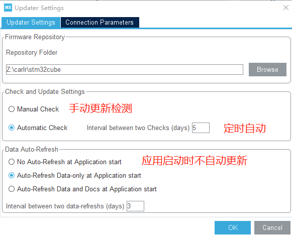

* 在help->Embedded software packages Manager中下载对应芯片的软件包
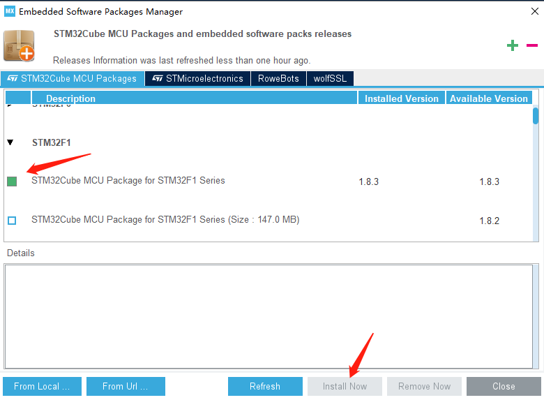

# 3. 创建工程

## 3.1 创建

* 菜单栏file->new project
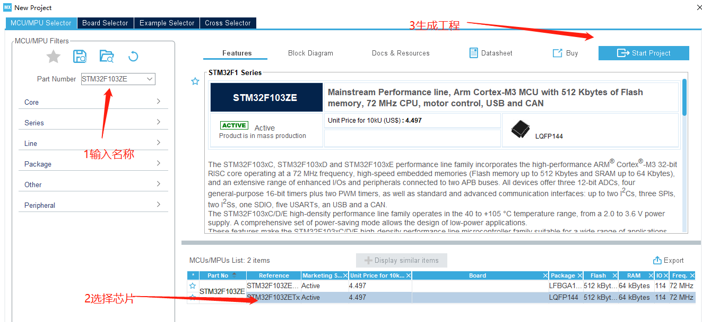
这里能方面的查看芯片的信息和相关文档！

## 3.2 时钟配置
这里根据自己硬件来设置，我使用的是8M外部无源晶振。
打开左侧System Core标签下的RCC来配置高速\低速时钟的模式
* Crystal/Ceramic Resonator 外部晶体/陶瓷谐振器模式(无源晶振选这个)
* BYPASS clock source 外部时钟源旁路模式(有源晶振选这个)
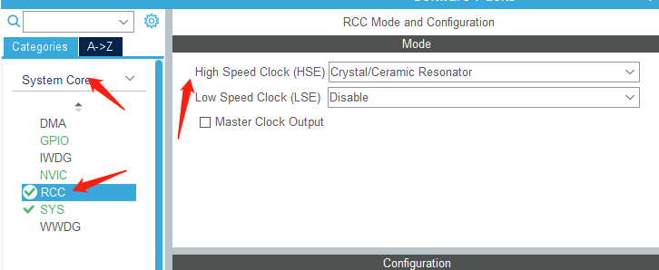

然后点击菜单栏的Clock Configuration配置时钟树。
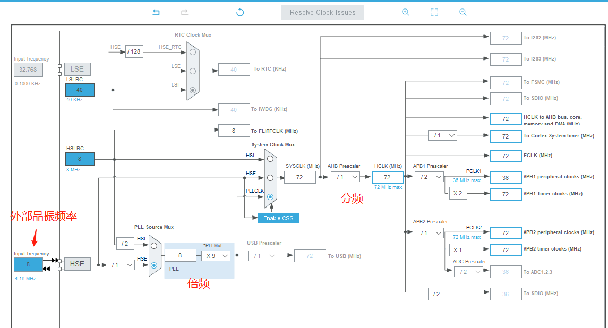


## 3.3 调试配置
不进行配置是无法使用调试功能的，也可以选择SW等，会初始化对应的引脚。
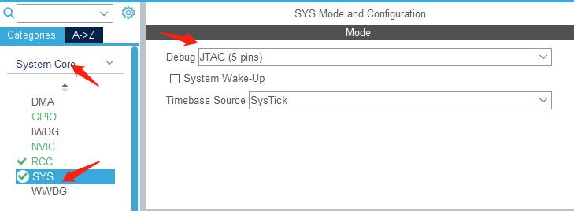

## 3.4 GPIO配置
在界面右侧的芯片引脚图中可以直接点击来配置所需要的引脚模式
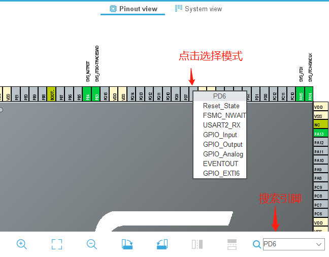
然后在左侧菜单栏选择GPIO可以进行详细设置
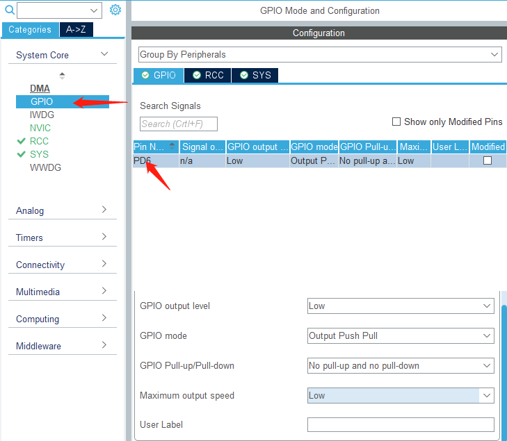

## 3.5 USART配置
在界面左侧选择Connectivity->USART,然后设置模式为异步通信（Asynchronous）,下面是串口配置，可以默认。
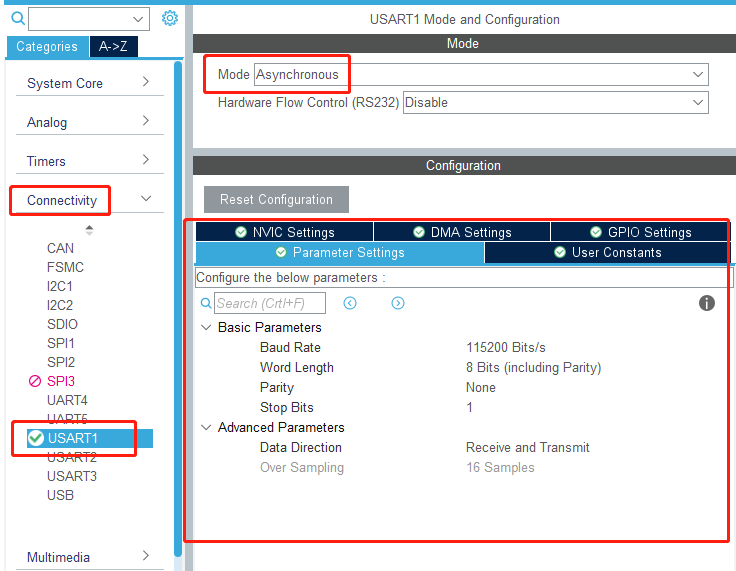
然后点击NVIC Settings勾选中断
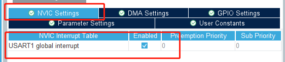


# 4. 生成代码
上侧菜单栏选择Project Manager，然后对工程进行配置
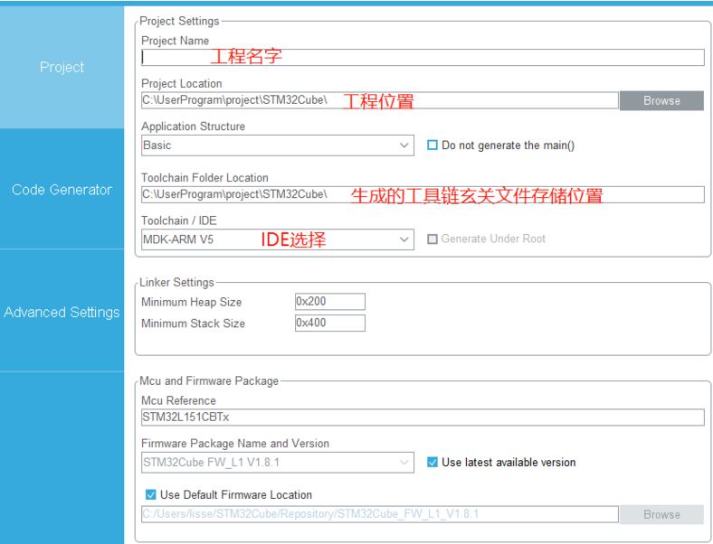
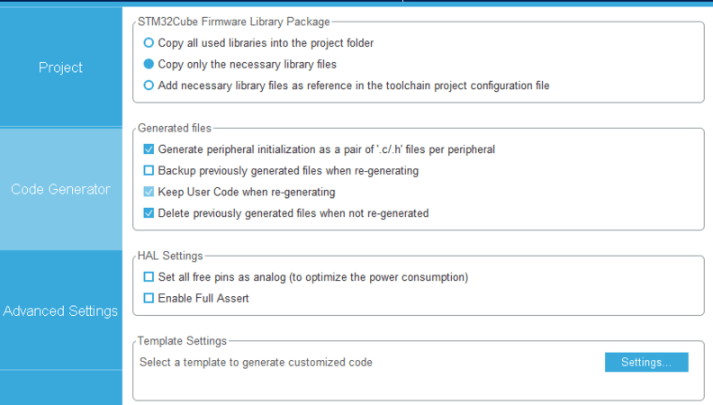
最后点击右上角的GENERATE CODE，至此便完成了工程的建立

# 5. keil工程
## 5.1 环境
* 下载jlink驱动：[官网](https://www.segger.com/downloads/jlink/)，点开J-Link Software and Documentation Pack标签，按需下载。
* 下载KEIL：[官网](https://www2.keil.com/mdk5/)

## 5.1 GPIO例程
例程根据上列3.4配置生成
* 图形化的引脚配置被生成在了gpio.c文件中
* stm32f1xx_hal_msp.c包含使用的库函数初始化了反初始化
* stm32f1xx_it.c包含中断函数接口
* system_stm32f1xx.c里面主要是配置了时钟
* main.c中全部配置工作都已经完成，只需要在main函数中编写应用代码即可，例如不断切换引脚电平
```
int main(void)
{
  /* USER CODE BEGIN 1 */
  /* USER CODE END 1 */
  /* MCU Configuration--------------------------------------------------------*/
  /* Reset of all peripherals, Initializes the Flash interface and the Systick. */
  HAL_Init();
  /* USER CODE BEGIN Init */
  /* USER CODE END Init */
  /* Configure the system clock */
  SystemClock_Config();
  /* USER CODE BEGIN SysInit */
  /* USER CODE END SysInit */
  /* Initialize all configured peripherals */
  MX_GPIO_Init();
  /* USER CODE BEGIN 2 */
  /* USER CODE END 2 */
  /* Infinite loop */
  /* USER CODE BEGIN WHILE */
  while (1)
  {
    /* USER CODE END WHILE */
    HAL_GPIO_WritePin(GPIOD, GPIO_PIN_6, GPIO_PIN_RESET);
    HAL_Delay(1000);
    HAL_GPIO_WritePin(GPIOD, GPIO_PIN_6, GPIO_PIN_SET);
    HAL_Delay(1000);
    /* USER CODE BEGIN 3 */
  }
  /* USER CODE END 3 */
}
```

## 5.2 USART例程
### 5.2.1 添加printf映射
```
#include <stdio.h>
int fputc(int ch, FILE *f)
{
  HAL_UART_Transmit(&huart1, (uint8_t *)&ch, 1, 0xffff);
  return ch;
}
int fgetc(FILE *f)
{
  uint8_t ch = 0;
  HAL_UART_Receive(&huart1, &ch, 1, 0xffff);
  return ch;
}
```
### 5.2.2 发送
串口发送实际上是将逐个字节扔到一个8位寄存器中去，然后以起始位+数据位+奇偶校验位+停止位组成一帧数据进行发送。
* 发送函数，在规定时间进行发送，未能发送成功则返回HAL_TIMEOUT
```
HAL_UART_Transmit(UART_HandleTypeDef *huart, uint8_t *pData, uint16_t Size, uint32_t Timeout)
HAL_UART_Transmit(&huart1,txBuffer,10,0xffff);
```
* 串口中断发送，使能发送中断后，在中断中进行逐个数据的发送，发送完成后调用回调函数。
```
HAL_StatusTypeDef HAL_UART_Transmit_IT(UART_HandleTypeDef *huart, uint8_t *pData, uint16_t Size)
HAL_UART_Transmit_IT(&huart1,txBuffer,10);
void HAL_UART_TxCpltCallback(UART_HandleTypeDef *huart)
{
	 if(huart == &huart1)
	 {
		   flag++;
	 }
}
```


### 5.2.3 接收
* 阻塞接收，在规定时间内程序阻塞在此等待接收规定的数据个数
```
HAL_StatusTypeDef HAL_UART_Receive(UART_HandleTypeDef *huart, uint8_t *pData, uint16_t Size, uint32_t Timeout)
HAL_UART_Receive(&huart1,rxBuffer,3,5000);
```

* 中断接收，在需要接收的位置启动HAL_UART_Receive_IT，数据接收完毕后将触发接收完成中断HAL_UART_RxCpltCallback
```
HAL_UART_Receive_IT(&huart1, rxBuffer, 1);
void HAL_UART_RxCpltCallback(UART_HandleTypeDef *huart)
{
	 if(huart == &huart1)
	 {
		  recvDataNumber++;
		  HAL_UART_Receive_IT(huart, rxBuffer, 1);
	 }
}
```
