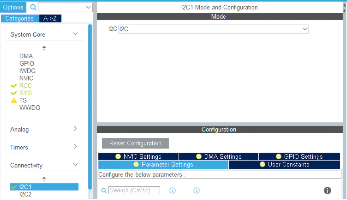
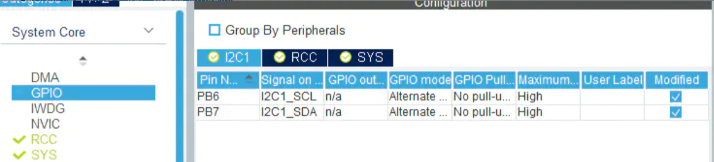
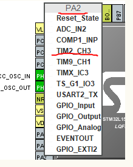
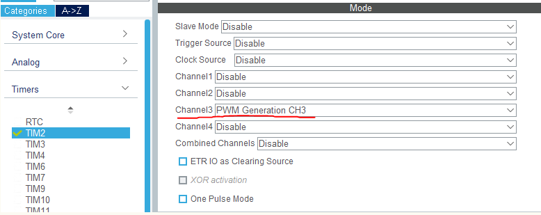
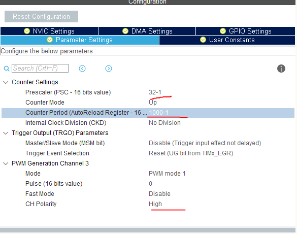

# 1. 前言
本文主要是迁移之前的文章，然后做补充和完善。
STM32cubemx工具是一个图形化初始代码生成器，极大简化工程建立和配置等的时间消耗。详情直接见[官网](https://www.st.com/zh/development-tools/stm32cubemx.html)即可。
此工具我主要是用来测试三方模块是否正常工作，当主工程比较复杂，其中某个模块出现了BUG，那么首先就是检测模块的驱动和模块本身是否有问题，如果直接在主工程中未能找到，则就将其独立出来，用STM32cubemx来建立一个新工程，单独测试。
还有个功能就是翻阅芯片的信息和文档，非常方便。

<!-- more -->
# 2. 安装相关软件

* [STM32cubemx](https://www.st.com/zh/development-tools/stm32cubemx.html)：其中有三个版本，linux，mac和win，根据自己系统下载即可。官网下载需要登录，未登录点下载时让你填写邮箱别乱写，他要发验证过去，不会让你直接下载的 - -|

* 安装java，直接去[官网](https://www.java.com/zh-CN/)下载，安装的时候勾选配置环境变量即可。

* 我用的window，STM32cubemx下载文件里面就一个exe，直接安装，安装过程中没啥要注意的。

* 打开STM32CubeMX，它会自动更新，建议架"梯子"，不然很慢，和KEIL那个更新一样。在菜单栏help->Updater Settings可以进行配置.


* 在help->Embedded software packages Manager中下载对应芯片的软件包


# 3. 创建工程

## 3.1 创建

* 菜单栏file->new project

这里能方面的查看芯片的信息和相关文档！

## 3.2 时钟配置
这里根据自己硬件来设置，我使用的是8M外部无源晶振。
打开左侧System Core标签下的RCC来配置高速\低速时钟的模式
* Crystal/Ceramic Resonator 外部晶体/陶瓷谐振器模式(无源晶振选这个)
* BYPASS clock source 外部时钟源旁路模式(有源晶振选这个)


然后点击菜单栏的Clock Configuration配置时钟树。


## 3.3 调试配置
不进行配置是无法使用调试功能的，也可以选择SW等，会初始化对应的引脚。


## 3.4 GPIO配置
在界面右侧的芯片引脚图中可以直接点击来配置所需要的引脚模式

然后在左侧菜单栏选择GPIO可以进行详细设置


## 3.5 USART配置
在界面左侧选择Connectivity->USART,然后设置模式为异步通信（Asynchronous）,下面是串口配置，可以默认。

然后点击NVIC Settings勾选中断


## 3.6 IIC配置
* 开启IIC，参数可默认

* 将GPIO设置成无需上下拉，依靠外部电路即可

* 关于生成代码，主要在i2c.c中，该工程已经将IIC初始化相关操作完成，我们要做的仅仅是进行设备的读写了而已。这里简单说明一下自动生成的代码。
他首先在工程中添加了stm32l1xx_hal_i2c.c，这便是我们调用的驱动库，然后在stm32l1xx_hal_conf.h中打开了宏#define HAL_I2C_MODULE_ENABLED，至此在算将IIC库引入了进来。
接下来便是通过驱动库来初始化IIC，i2c.c中的HAL_I2C_MspInit和HAL_I2C_MspDeInit是对引脚的初始化和反初始化，但是不需要我们来调用，他在库中被弱实现，在使用库函数HAL_I2C_Init来初始化的时候，内部将会调用此函数来进行引脚初始化，所以这里仅仅是来实现这个函数而已。实际在主函数调用的IIC初始化函数是MX_I2C1_Init，他是根据在cube中的配置信息来初始化IIC的。

## 3.7 PWM配置
* 选择PA2为PWM的通道

* 配置对于的时钟TIM2，选择通道3

* 配置该PWM通道，系统时钟32M(这里是由于换了芯片L151是32M的)


# 4. 生成代码
上侧菜单栏选择Project Manager，然后对工程进行配置


最后点击右上角的GENERATE CODE，至此便完成了工程的建立

# 5. keil工程
## 5.1 环境
* 下载jlink驱动：[官网](https://www.segger.com/downloads/jlink/)，点开J-Link Software and Documentation Pack标签，按需下载。
* 下载KEIL：[官网](https://www2.keil.com/mdk5/)

## 5.1 GPIO例程
例程根据上列3.4配置生成
* 图形化的引脚配置被生成在了gpio.c文件中
* stm32f1xx_hal_msp.c包含使用的库函数初始化了反初始化
* stm32f1xx_it.c包含中断函数接口
* system_stm32f1xx.c里面主要是配置了时钟
* main.c中全部配置工作都已经完成，只需要在main函数中编写应用代码即可，例如不断切换引脚电平
```
int main(void)
{
  /* USER CODE BEGIN 1 */
  /* USER CODE END 1 */
  /* MCU Configuration--------------------------------------------------------*/
  /* Reset of all peripherals, Initializes the Flash interface and the Systick. */
  HAL_Init();
  /* USER CODE BEGIN Init */
  /* USER CODE END Init */
  /* Configure the system clock */
  SystemClock_Config();
  /* USER CODE BEGIN SysInit */
  /* USER CODE END SysInit */
  /* Initialize all configured peripherals */
  MX_GPIO_Init();
  /* USER CODE BEGIN 2 */
  /* USER CODE END 2 */
  /* Infinite loop */
  /* USER CODE BEGIN WHILE */
  while (1)
  {
    /* USER CODE END WHILE */
    HAL_GPIO_WritePin(GPIOD, GPIO_PIN_6, GPIO_PIN_RESET);
    HAL_Delay(1000);
    HAL_GPIO_WritePin(GPIOD, GPIO_PIN_6, GPIO_PIN_SET);
    HAL_Delay(1000);
    /* USER CODE BEGIN 3 */
  }
  /* USER CODE END 3 */
}
```

## 5.2 USART例程
### 5.2.1 添加printf映射
```
#include <stdio.h>
int fputc(int ch, FILE *f)
{
  HAL_UART_Transmit(&huart1, (uint8_t *)&ch, 1, 0xffff);
  return ch;
}
int fgetc(FILE *f)
{
  uint8_t ch = 0;
  HAL_UART_Receive(&huart1, &ch, 1, 0xffff);
  return ch;
}
```
### 5.2.2 发送
串口发送实际上是将逐个字节扔到一个8位寄存器中去，然后以起始位+数据位+奇偶校验位+停止位组成一帧数据进行发送。
* 发送函数，在规定时间进行发送，未能发送成功则返回HAL_TIMEOUT
```
HAL_UART_Transmit(UART_HandleTypeDef *huart, uint8_t *pData, uint16_t Size, uint32_t Timeout)
HAL_UART_Transmit(&huart1,txBuffer,10,0xffff);
```
* 串口中断发送，使能发送中断后，在中断中进行逐个数据的发送，发送完成后调用回调函数。
```
HAL_StatusTypeDef HAL_UART_Transmit_IT(UART_HandleTypeDef *huart, uint8_t *pData, uint16_t Size)
HAL_UART_Transmit_IT(&huart1,txBuffer,10);
void HAL_UART_TxCpltCallback(UART_HandleTypeDef *huart)
{
	 if(huart == &huart1)
	 {
		   flag++;
	 }
}
```


### 5.2.3 接收
* 阻塞接收，在规定时间内程序阻塞在此等待接收规定的数据个数
```
HAL_StatusTypeDef HAL_UART_Receive(UART_HandleTypeDef *huart, uint8_t *pData, uint16_t Size, uint32_t Timeout)
HAL_UART_Receive(&huart1,rxBuffer,3,5000);
```

* 中断接收，在需要接收的位置启动HAL_UART_Receive_IT，数据接收完毕后将触发接收完成中断HAL_UART_RxCpltCallback
```
HAL_UART_Receive_IT(&huart1, rxBuffer, 1);
void HAL_UART_RxCpltCallback(UART_HandleTypeDef *huart)
{
	 if(huart == &huart1)
	 {
		  recvDataNumber++;
		  HAL_UART_Receive_IT(huart, rxBuffer, 1);
	 }
}
```
## 5.3 IIC例程
测试程序-HTU21D温湿度
以下列举库中我们可能用到的库函数，取至库函数抬头的注释
```
    (#) Blocking mode functions are :
        (++) HAL_I2C_Master_Transmit()
        (++) HAL_I2C_Master_Receive()
        (++) HAL_I2C_Slave_Transmit()
        (++) HAL_I2C_Slave_Receive()
        (++) HAL_I2C_Mem_Write()
        (++) HAL_I2C_Mem_Read()
        (++) HAL_I2C_IsDeviceReady()
        
    (#) No-Blocking mode functions with Interrupt are :
        (++) HAL_I2C_Master_Transmit_IT()
        (++) HAL_I2C_Master_Receive_IT()
        (++) HAL_I2C_Slave_Transmit_IT()
        (++) HAL_I2C_Slave_Receive_IT()
        (++) HAL_I2C_Master_Sequential_Transmit_IT()
        (++) HAL_I2C_Master_Sequential_Receive_IT()
        (++) HAL_I2C_Slave_Sequential_Transmit_IT()
        (++) HAL_I2C_Slave_Sequential_Receive_IT()
        (++) HAL_I2C_Mem_Write_IT()
        (++) HAL_I2C_Mem_Read_IT()

    (#) No-Blocking mode functions with DMA are :
        (++) HAL_I2C_Master_Transmit_DMA()
        (++) HAL_I2C_Master_Receive_DMA()
        (++) HAL_I2C_Slave_Transmit_DMA()
        (++) HAL_I2C_Slave_Receive_DMA()
        (++) HAL_I2C_Mem_Write_DMA()
        (++) HAL_I2C_Mem_Read_DMA()

    (#) A set of Transfer Complete Callbacks are provided in non Blocking mode:
        (++) HAL_I2C_MemTxCpltCallback()
        (++) HAL_I2C_MemRxCpltCallback()
        (++) HAL_I2C_MasterTxCpltCallback()
        (++) HAL_I2C_MasterRxCpltCallback()
        (++) HAL_I2C_SlaveTxCpltCallback()
        (++) HAL_I2C_SlaveRxCpltCallback()
        (++) HAL_I2C_ErrorCallback()
        (++) HAL_I2C_AbortCpltCallback()
```
编写两个函数，一个发送命令使其复位传感器，一个读温度数据
前者的命令格式是地址+命令，所以使用了HAL_I2C_Master_Transmit，通信成功了就返回0
```
int htu21d_soft_reset()
{
	  uint8_t val = 0xFE;
	  if(HAL_I2C_Master_Transmit(&hi2c1,0X80,&val,1,100) == HAL_OK)
		{
		    return 0;
		}			
		else
		{
		   return 1;
		}
}
```
这里补充一下，IIC设备非常多，很多传感器说明文档的地址表述方式不一样，使其有的需要自己移位来得到实际填入地址，有的着不需要。当然你可以自己仔细看文档，然后再追踪代码看库函数的具体实现，得到自己应该填写的地址，这里库函数仅仅是补上了读写位。 还有一种比较暴力的方法，但是挺好用的，那就是轮询地址。反正一般地址就0到FF间，一个循环，几秒钟的找出来了。
例如上列修改成
```
uint8_t i;
uint8_t val =0xfe;
for(i=0;i<0xff;i++)
{
    if(HAL_I2C_Master_Transmit(&hi2c1,i,&val,1,100) == HAL_OK)
   {
        printf("%02X\n",i);
   }
}
```
然后就会看到在0X80和0X81的被打印出来，一个读一个写。

然后时读温度函数，这里需要用的具体寄存器地址所以需要使用HAL_I2C_Mem_Read函数
```
uint16_t htu21d_get_temp()
{
    uint16_t temp=0;
	  float temp_f=0;
	  uint8_t buff[2];
	  
	  if(HAL_I2C_Mem_Read(&hi2c1,0X81,0XE3,I2C_MEMADD_SIZE_8BIT,buff,2,100) == HAL_OK)
		{
		    uint16_t ret = (buff[0] << 8) | (buff[1] & 0xfc);	
			  temp_f = ret*175.72/65536-46.85;		
		    temp = (uint16_t)(temp_f*10.0);
		}
		else
		{
		   temp=0;
		}
	  return temp;
}
```

## 5.4 PWM代码
主函数中初始化了GPIO和TIM，前者仅仅打开了GPIO的时钟，主要初始化在TIM中。
```
//main.h
  MX_GPIO_Init();
  MX_TIM2_Init();
```
在tim.c则进行了对于通道引脚初始化和定时器PWM初始化
```
//初始化PA2对于定时器TIM2的CH3
void HAL_TIM_MspPostInit(TIM_HandleTypeDef* timHandle)
{

  GPIO_InitTypeDef GPIO_InitStruct = {0};
  if(timHandle->Instance==TIM2)
  {
    __HAL_RCC_GPIOA_CLK_ENABLE();
    GPIO_InitStruct.Pin = GPIO_PIN_2;
    GPIO_InitStruct.Mode = GPIO_MODE_AF_PP;
    GPIO_InitStruct.Pull = GPIO_NOPULL;
    GPIO_InitStruct.Speed = GPIO_SPEED_FREQ_LOW;
    GPIO_InitStruct.Alternate = GPIO_AF1_TIM2;
    HAL_GPIO_Init(GPIOA, &GPIO_InitStruct);
  }
}
```
定时器初始化的时候将进行时钟配置，这决定了PWM的频率，Prescaler表示分频数，表示如果最终分频到TIM的时钟是32M，那么实际使用时钟则是32/Prescaler。Period代表定时器计数达到多少后重新装填，对于PWM来说就代表了一个周期，所以PWM的频率就等于48M/Prescaler/Period。Pulse就对应占空比了，他代表当前计数，占空比 = Pulse/Period
```
void MX_TIM2_Init(void)
{
  TIM_MasterConfigTypeDef sMasterConfig = {0};
  TIM_OC_InitTypeDef sConfigOC = {0};

  htim2.Instance = TIM2;
  htim2.Init.Prescaler = 32-1;//分频
  htim2.Init.CounterMode = TIM_COUNTERMODE_UP;//向上计数
  htim2.Init.Period = 1000-1;//阈值
  htim2.Init.ClockDivision = TIM_CLOCKDIVISION_DIV1;
  if (HAL_TIM_PWM_Init(&htim2) != HAL_OK)
  {
    Error_Handler();
  }
  sMasterConfig.MasterOutputTrigger = TIM_TRGO_RESET;
  sMasterConfig.MasterSlaveMode = TIM_MASTERSLAVEMODE_DISABLE;
  if (HAL_TIMEx_MasterConfigSynchronization(&htim2, &sMasterConfig) != HAL_OK)
  {
    Error_Handler();
  }
  sConfigOC.OCMode = TIM_OCMODE_PWM1;
  sConfigOC.Pulse = 0;//PWM初始计数值  0/1000
  sConfigOC.OCPolarity = TIM_OCPOLARITY_HIGH;
  sConfigOC.OCFastMode = TIM_OCFAST_DISABLE;
  if (HAL_TIM_PWM_ConfigChannel(&htim2, &sConfigOC, TIM_CHANNEL_3) != HAL_OK)
  {
    Error_Handler();
  }
  HAL_TIM_MspPostInit(&htim2);

}
```
之后的启动和占空比修改就需要自己调用stm32l1xx_hal.time.c中的函数来执行了
|函数|说明|
|---|---|
|HAL_StatusTypeDef HAL_TIM_PWM_Start(TIM_HandleTypeDef *htim, uint32_t Channel)|启动对应通道的PWM|
|HAL_StatusTypeDef HAL_TIM_PWM_Stop(TIM_HandleTypeDef *htim, uint32_t Channel)|停止对应通道的PWM|

|宏|说明|
|---|---|
|__HAL_TIM_SET_COMPARE(__HANDLE__, __CHANNEL__, __COMPARE__)|配置对于通道占空比|

下面是在tim.c中添加的函数
```
void USR_TIM_PWM_OpenTim2Ch3()
{
	HAL_TIM_PWM_Start(&htim2,TIM_CHANNEL_3);
}

void USR_TIM_PWM_CloseTim2Ch3()
{
  HAL_TIM_PWM_Stop(&htim2,TIM_CHANNEL_3);
}

//duty == 0~1000
void USR_TIM_PWM_SetCompare(uint16_t duty)
{
   if(duty >1000) //这里1000是因为计数阈值被设置成了1千
	 {
		  duty=1000;
	 }
	 __HAL_TIM_SET_COMPARE(&htim2, TIM_CHANNEL_3, duty);
   
}
```
最后在主函数中调用进行测试
先添加打印定向，使其能够printf输出
```
#include "stdio.h"
#ifdef __GNUC__
#define PUTCHAR_PROTOTYPE int __io_putchar(int ch)
#else
#define PUTCHAR_PROTOTYPE int fputc(int ch, FILE *f)
#endif /* __GNUC__ */
PUTCHAR_PROTOTYPE
{
	HAL_UART_Transmit(&huart1 , (uint8_t *)&ch, 1, 0xFFFF);
	return ch;
}
```
然后启动PWM，设置占空比50%
```
 USR_TIM_PWM_OpenTim2Ch3();
USR_TIM_PWM_SetCompare(500); //50%
```

* STM32L系列定时器通道对应关系

|引脚号|定时器通道|
|---|---|
|PA0|TIM2_CH1_ETR|
|PA1|TIM2_CH2|
|PA2|TIM2_CH3|
|PA3|TIM2_CH4|
|PA6|TIM3_CH1|
|PA7|TIM3_CH2|
|PB0|TIM3_CH3|
|PB1|TIM3_CH4|
|PB6|TIM4_CH1|
|PB7|TIM4_CH2|
|PB8|TIM4_CH3|
|PB9|TIM4_CH4|