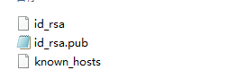
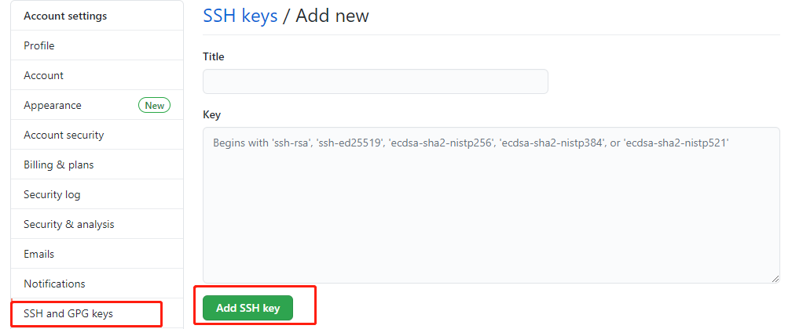
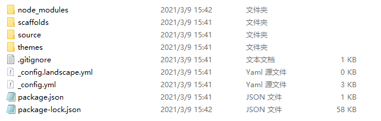
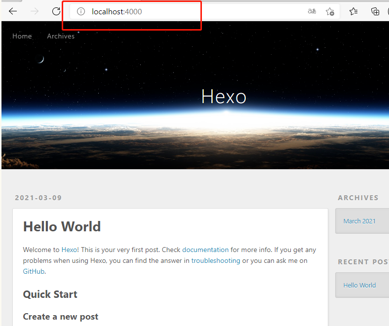
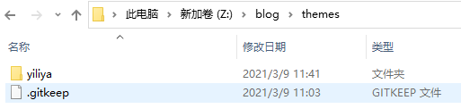
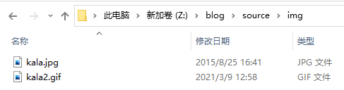
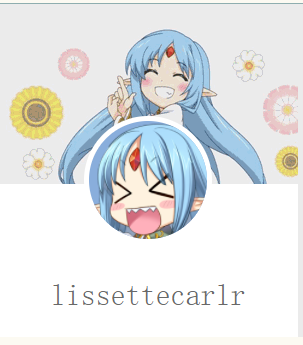
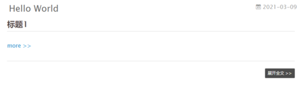
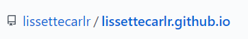

# 1. 前言
本文主要描述在win10和linux下搭建hexo，修改主题，然后去GitHub上或VPS上部署，也是刚接触，如有错误，望指正。

<!-- more -->

# 2. 博客搭建

## 2.1 环境

### 2.1.1 WIN10

* 安装nodejs
[官网下载](https://nodejs.org/en/)
打开powershell，以下命令均在此中执行
```
node -v
npm -v
```
* 更换npm源（npm能用就忽略）
```
npm install -g --registry=https://registry.npm.taobao.org
```

* 下载hexo，换了源则用cnpm

```
npm install -g hexo-cli
```

### 2.1.2 ubuntu
```
apt-get install update
apt-get install nodejs
apt-get install npm
npm install -g hexo-cli
apt-get install git

```

### 2.1.3 git 配置

```
git config --global user.name "name"
git config --global user.email email@gmail.com
```

* 与github使用ssh通信（可选）
主要是我在github上拉取推送的时候经常超时，不得不才有此方式。
```
ssh-keygen -t rsa -C "youremail@example.com"
```
然后让输入的地方全部回车，之后会在C:\Users\用户名\.ssh文件夹生成。
ubuntu被保存在/home/ubuntu/.ssh/

复制id_rsa.pub中所以文本，打开GitHub设置，找到SSH and GPG keys选项，子页面点开New SSH key，将复制的内容粘贴进去，点击Add SSH key成功添加

使用命令测试连接：
```
ssh -T git@github.com
返回
Hi lissettecarlr! You've successfully authenticated, but GitHub does not provide shell access.
```
此后克隆推拉都使用git@xxxx，而不使用https，就不会出现超时等连不上的错误了，对于已经使用https克隆的仓库也可以如下修改

```
//搜先查看实际的通信方式
git remote -v
//移除https方式，换成ssh
git remote rm origin
git remote add origin git@xxxx
//再次查看
git remote -v
//可以推送试一试，以下是我推送博客到blog分支
git push origin blog
```

## 2.2 初始化博客
* 创建一个保存博客的位置blog
```
mkdir blog
```
* 在该文件夹中执行初始化
```
hexo init
```
将会生成下列文件，至此基础博客就搭建起来了

* 启动博客
```
hexo s
```
打开浏览器，输入地址http://localhost:4000/，便可以看到


## 2.3 配置
### 2.3.1 文章的图片相关配置（具体可见文章《vscode编辑MD图片粘贴插件》）

* 修改blog/_config.yml
```
post_asset_folder: true
```
* 下载插件
```
npm install https://github.com/CodeFalling/hexo-asset-image --save
```
### 2.3.2 主题
[yilia主题](https://github.com/litten/hexo-theme-yilia)
安装方式里面也有写，这里就复述一遍:

* 把主题文件克隆下来扔到themes中去
```
git clone https://github.com/litten/hexo-theme-yilia.git themes/yilia
```

* 修改blog/_config,yml配置文件，注意不是主题文件里面的哦！
```
theme: yilia
```

## 2.3.3 主题的一些配置
* 修改头像
在yilia主题文件夹里面也有个_config.yml，里面保存着配置文件。
找到avatar:后面就是填写头像地址，例如我在source文件夹里面建了个img文件夹用于保存图片，往里扔头像图片kala.jpg。

然后修改主题里的配置文件_config.yml
```
#你的头像url
avatar: /img/kala.jpg
```
* 在头像上方添加动图
修改主题里的配置文件_config.yml
```
style:
# 左侧头像板块动态图效果
  gif:
    # 是否启用
    enable: true
    # 自定义背景图路径(默认可以不设置，提供默认背景图biubiubiu.gif)
    path: /img/kala2.gif
```
然后再找到\blog\themes\yilia\layout\\_partial文件夹下的left-col.ejs修改
```
<% var defaultBg = '#4d4d4d'; %>
<% var defaultBgImg = '/img/kala2'; %>
<% var overlayBgImg= theme.style.gif && theme.style.gif.enable && theme.style.gif.path ? theme.style.gif.path : defaultBgImg; %>

<div class="overlay" style="background: <%= theme.style && theme.style.header ? theme.style.header : defaultBg %>;<% if (theme.style.gif && theme.style.gif.enable){ %>background: url('<%- url_for(overlayBgImg) %>') no-repeat ;<%}%> z-index:-1"></div>
```
效果如下：


* 取消一些主题的印迹
在\blog\themes\yilia\layout\\_partial中footer.ejs中
```
<a href="http://hexo.io/" target="_blank">Hexo</a>  Theme <a href="https://github.com/litten/hexo-theme-yilia" target="_blank">Yilia</a> by Litten 
改为
<a href="http://hexo.io/" target="_blank">Hexo</a> 
```
此处也可以修改为备案信息
```
<a href="https://beian.miit.gov.cn/#/Integrated/index" target="_blank">渝ICP备2021002648号-1</a> 
```

* 翻页设置
修改文件themes\yilia\layout\\_partial\archive.ejs的8行、9行、37行和38行
```
prev_text: '上一页',
next_text: '下一页;'
```
修改文件themes\yilia\layout\\_partial\script.ejs
搜索&laquo; Prev，改为上一页
搜索next &raquo，改为下一页
## 2.4 写文章

* 创建一个新文章,被默认保存在blog\source\\_posts
```
hexo new "新建文章"
```
* 添加图片
按照上文配置后，会在_posts中生成一个文章同名文件夹，属于该文章的图片就放入此中，引用就以下列方式使用相对路径
```

```
* 文章title部分
文章在使用命令建立则自动添加，手动建立则需要自己补充，示例如下
```
---
title: hexo的搭建和部署
date: 2021-03-15 17:09:14
tags:
    -hexo
reward: true
---
```
* 文章外部显示部分（属于主题的配置）
```
<!-- more --> 以下内容将被隐藏
```


## 2.5 其他
* 发生报错
```
报错：
INFO  Validating config
WARN  Deprecated config detected: "external_link" with a Boolean value is deprecated. See https://hexo.io/docs/configuration for more details.
```
修改配置文件
```
//原
external_link: true # Open external links in new tab
//改
external_link:
  enable: true # Open external links in new tab
  field: site # Apply to the whole site
  exclude: ''
```

* 看板娘
```
npm install --save hexo-helper-live2d
```
选个模型https://huaji8.top/post/live2d-plugin-2.0/
```
npm install live2d-widget-model-模型名
```
配置博客的config.yml
```
# Live2D
## https://github.com/EYHN/hexo-helper-live2d
live2d:
  enable: true
  scriptFrom: local
  pluginRootPath: live2dw/
  pluginJsPath: lib/
  pluginModelPath: assets/
  tagMode: false
  debug: false
  model:
    use: live2d-widget-model-hijiki # 模型：https://huaji8.top/post/live2d-plugin-2.0/
  display:
    position: right
    width: 150
    height: 300
  mobile:
    show: true
```

# 3. 部署博客

## 3.1 github
***以下是在建立了ssh通信的方式时***
### 3.1.1 部署
* 在github上新建个仓库，名称要与用户名一直，如下

* 在博客根目录安装插件
```
npm install --save hexo-deployer-git
```
修改根目录下的_config.yml
```
# Deployment
## Docs: http://hexo.io/docs/deployment.html
deploy:
 type: git
 repository: git@github.com:lissettecarlr/lissettecarlr.github.com.git
 branch: master
```

* 静态文件
```
hexo g
```
此命令将生成一个public文件夹，里面保存的就是部署网页用的静态页面。

* 部署，这里实际就是把public文件给仍上去了
```
hexo d
```
可能会出现两种问题，第一种是SSH密匙没弄好，第二种是_config.yml文件修改错了。
使用lissettecarlr.github.io可以查看部署后的网页


### 3.1.2 自动部署
使用github的actions功能，这里需要新建一个分支，也就是之前的master分支保存了public中的网页静态文件，新建的分支是保存hexo博客的基础文件，之后只需要在增改文章后，推送此分支，就会自动部署。
以下是git分支命令的参考
```
git add -A
git commit -a -m "init"
git branch blog
git checkout blog
git remote add origin git@xxxxxxx
git push origin blog
```
在博客根目录建立文件夹和文件/.github/workflows/deploy.yml
```
name: Build and Deploy
on: [push]
jobs:
  build-and-deploy:
    runs-on: ubuntu-latest
    steps:
      - name: Checkout 🛎️
        uses: actions/checkout@v2 # If you're using actions/checkout@v2 you must set persist-credentials to false in most cases for the deployment to work correctly.
        with:
          persist-credentials: false

      - name: Install and Build 🔧 # This example project is built using npm and outputs the result to the 'build' folder. Replace with the commands required to build your project, or remove this step entirely if your site is pre-built.
        run: |
          npm install
          npm run build
        env:
          CI: false

      - name: Deploy 🚀
        uses: JamesIves/github-pages-deploy-action@releases/v3
        with:
          GITHUB_TOKEN: ${{ secrets.GITHUB_TOKEN }}
          BRANCH: master # The branch the action should deploy to.
          FOLDER: public # The folder the action should deploy.
```

之后修改直接推送就自动部署了
```
git add -A
git commit -a -m "init"
git push origin blog
```

## 3.2 vps
这里我直接拉取github上面的部署文件，然后用nginx指向它就OK了。
* 安装nginx
```
sudo apt-get install nginx
nginx -v
```
* 启动nginx
```
service nginx start
```
* git 拉取部署文件
```
git clone https://github.com/lissettecarlr/lissettecarlr.github.io.git
```
* 记录下地址，然后进入/etc/nginx/sites-available修改default
```
sudo vim default
# root /var/www/html;
root /home/ubuntu/lissettecarlr.github.io/;
```

* 重启nginx

```
service nginx restart
```