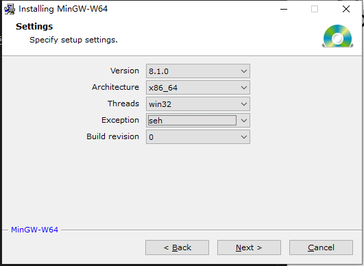
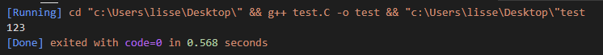

# 1. 前言

最近重装了台式机，所以需要再布置环境，并且刚搭建了hexo博客，便记录一下如何弄vscode中C的编译环境。

<!-- more -->

# 2. 安装MinGW(Minimalist GNU for Windows)
[下载地址](https://sourceforge.net/projects/mingw-w64/)
exe安装包直接点，然后途中的安装选择如下：


|名称|说明|
|---|---|
|Version|制定版本号，没啥额外条件就选最新的|
|Architecture|64位系统选择x86_64，32位系统选择i686|
|Threads|设置线程标准|
|Exception|设置异常处理系统|
|Build revision|没得选，默认|
安装完成后找到文件放置的目录，然后会看到一个mingw-w64.bat脚本，直接运行弹出的命令行窗体中便可以直接使用gcc进行测试安装情况。
要想全局使用肯定还是得配置环境变量，怎么配置其实就是对上面脚本右键编辑可以看到：
```
set PATH=C:\Program Files\mingw-w64\x86_64-8.1.0-win32-seh-rt_v6-rev0\mingw64\bin;%PATH%
```
直接复制地址对PATH进行添加即可，完成后打开cmd，使用gcc -v测试一下。

# 3. vscode插件

* C/C++
* Code Runner
安装完成后重启VSCODE
创建个文件测试一下，可以点击右上角的三角或者直接文本中右键run code
```
#include "stdio.h"

int main()
{
    printf("123");
    return 0;
}
```


# 4. 其他
code run默认是编译当前文件，所以当需要编译多个文件的时候可以修改配置。
在文件->首选项->设置中搜索run code，找到 Executor Map 在settings.json中找到C编译，将gcc $filename修改未gcc *.c后，则会对当前文件夹进行编译。