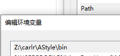
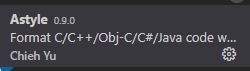
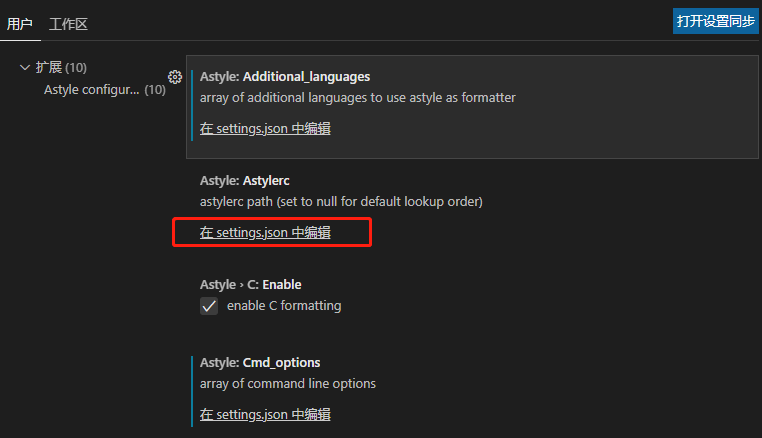

# 1. 前言
在看[RT-thread的代码规范](https://github.com/RT-Thread/rt-thread/blob/master/documentation/coding_style_cn.md)的时候发现了astyle的排版工具，于是就安装上来试了试，此文就是对其的记录。实际上嘛，在敲的时候就按照规范写，这工具也没啥用，不过在不得不看瞎写的代码的时候，用这东西格式化下还是挺舒服的。
<!-- more -->

# 1. 安装
* [下载astyle](https://sourceforge.net/projects/astyle/files/)，解压后将AStyle.exe添加到path环境变量

* 在vscode的扩展中搜索AStyle，进行安装，安装完成后重启vscode

* 修改AStyle的配置，插件点击齿轮，再选择扩展设置，随便找个点开，在setting.json中编辑

* 复制以下内容到其中，排版参数可见[文档](http://astyle.sourceforge.net/astyle.html#_Option_Files)
```
    "astyle.additional_languages": [
        "c",
        "cpp",
    ],
    "astyle.cmd_options": [
        "--style=allman",//风格格式和缩进
        "--indent=spaces=4",//缩进4个空格
        "--pad-oper",//操作符两端插入一个空格
        "--pad-header",// 'if', 'for', 'while'与后面的括号间加空格
        "--align-pointer=name",//将指针和取址符和变量名放一起
        "--convert-tabs",//Converts tabs into spaces in the non-indentation part of the line
        "--indent-preproc-block",//缩进宏定义
        "--unpad-paren", //移除多余括号
        "--suffix=none",//不保留原始文件
        "--lineend=windows",//windows \ linux \macold
        "--verbose",    //详细的显示模式
    ],
    "[c]": {
        "editor.defaultFormatter": "chiehyu.vscode-astyle"
    },
```

# 2. 使用
```
alt+shitf+f
```
示例代码
```
#ifndef _ASDF_
#define _ASDF_
#ifndef _ASDF__
#include "stdio.h"
#endif
#endif

void main(void)
{
int a = 1;
int b;
b=a;
char*foo1;
if(a=b){b=a;}
printf("%d\n",b+2);
}
```
自动排版后代码
```
#ifndef _ASDF_
    #define _ASDF_
    #ifndef _ASDF__
        #include "stdio.h"
    #endif
#endif

void main(void)
{
    int a = 1;
    int b;
    b = a;
    char *foo1;
    if (a = b)
    {
        b = a;
    }
    printf("%d\n", b + 2);
}
```