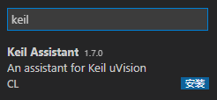
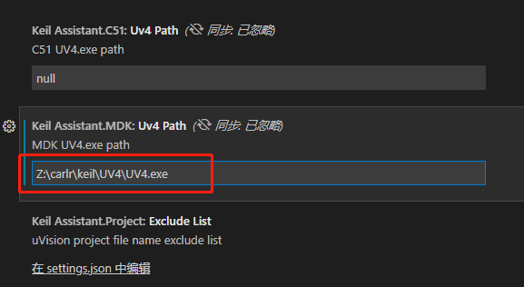
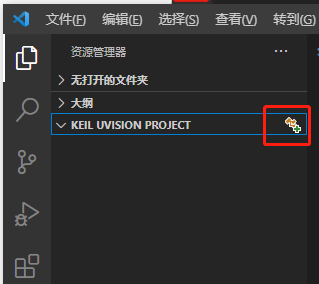
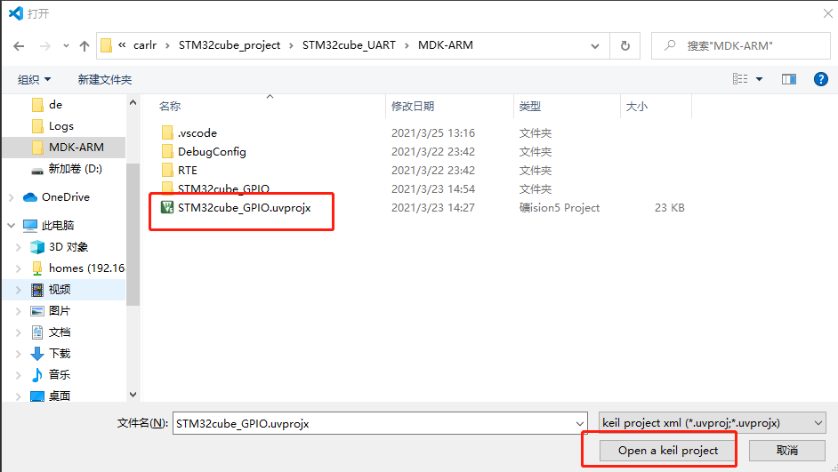
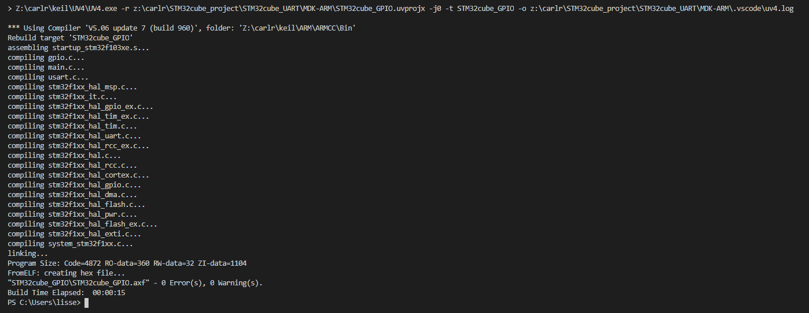
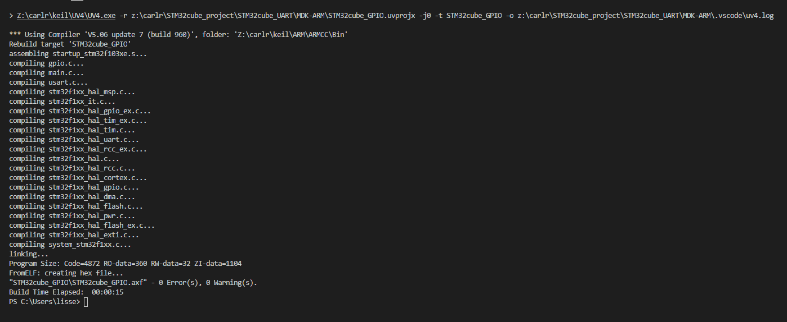

# 1. 前言
早就不想用keil的代码编辑器了，但是放不下它的编译器。Keil Assistant插件能解决这个问题，全程都使用vscode，不用再进行这边些代码，那边去编译的麻烦方式。
<!-- more -->

# 2. 安装和配置

* 首先需要安装keil和vscode两款软件
* 打开vscode，选择扩展(ctrl+shitf+x)，搜索keil，找到Keil Assistant插件(还得安装C/C++那个哦)

* 安装后点击扩展设置，配置keil的地址

# 3 使用
## 3.1 使用vscode打开keil的工程
* 在左侧窗体会发现多出了一栏，展开后点击右边的图标选择工程

* 选择工程

## 3.2 编译\下载\重编译
* 在打开工程后，鼠标移动到左侧工程目录上，会显示出三个图标，分别是编译、下载、重编译

* 点击编译后，在vscode的终端会打印日志
