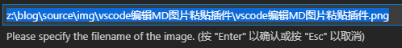
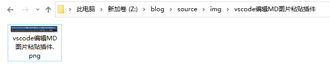

# 1. 前言

由于转移到了hexo下，文章都是MD格式，所以图片问题是首要解决的，简书和印象笔记都是直接粘贴图片，使用习惯后回不到手动填写图片地址的方式了，于是去找了找vscode上有没有插件支持粘贴的，还真找到了，paste Image

<!-- more -->

# 2. 配置

完全不用配置就可以直接用，先去复制一个图片，然后ctrl+alt+v粘贴进来。默认存放位置就是文本存放的位置，名称是日期，例如

```

```
使用此插件最终目的是，希望粘贴进来的图片被独立文件夹保存，并且好区分，现进行如下配置

* Paste Image: Default Name 填写
```
${currentFileNameWithoutExt}
```
* Paste Image: Base Path 填写
```
${projectRoot}
```
* Paste Image: Path 填写
```
${projectRoot}/source/img/${currentFileNameWithoutExt}
```
* Paste Image: Prefix 填写"\\"

以上配置是将hexo博客根目录作为了打开vscode工程的位置！

效果如下图

可见粘贴的图片是在img中新建了文件夹，名称就是文本的名称，然后图片也是文本的名称。


补充：hexo这样配置图片，在本地MD里面显示是没啥问题，但是部署后网页是显示不了的。网上查了下，貌似只能通过如下方式。当然如果你不是用hexo博客，那以下内容请无视。
* 首先打开config.yml中自动建文件夹的配置
```
post_asset_folder: true
```
然后此时新建文章时，他就会在同目录下同时新建一个文件夹
```
cd ./source/_posts
hexo new 测试
```

* 然后是安装一个插件
```
npm install https://github.com/CodeFalling/hexo-asset-image --save
```

* 配置paste image

Paste Image: Default Name 填写
```
p_
```
Paste Image: Base Path 填写
```
${projectRoot}/source/_posts
```
Paste Image: Path 填写
```
${currentFileNameWithoutExt}
```
Paste Image: Prefix 填空

* 之后图片格式就变为了，如此以来，才能在部署后被显示
```

```


# 3. paste image 中文说明

### 3.1用法

* 剪切或复制图片
* 对着你的文本直接Ctrl+Alt+V粘贴
* 图像将保存在包含当前编辑文件的文件夹中
 
### 3.2 配置

#### 3.2.1 图片名称

* ${currentFileName}带有文件后缀的名称
* ${currentFileNameWithoutExt}不带有后缀的名称
* Y-MM-DD-HH-mm-ss 时间显示

#### 3.2.2 图片存放地址

* ${currentFileDir} 文本目录地址
* ${projectRoot} VSCODE打开的项目地址
* ${currentFileName}
* ${currentFileNameWithoutExt}

#### 3.2.3 图片的基础路径

* ${currentFileDir}
* ${projectRoot}
* ${currentFileName}
* ${currentFileNameWithoutExt}

#### 3.2.4 粘贴前确认

* pasteImage.showFilePathConfirmInputBox 打勾是需要不打是直接粘贴

部分未翻译，可自行查看插件的介绍

#### 3.3 使用示例

如果使用VScode编辑hexo博客，则目录结构如下

```
blog/source/_posts  (articles)
blog/source/img     (images)
```

如果你想要保存图片在blog/source/img中，博客的根目录作为工程打开目录，则可以如下配置

```
"pasteImage.path": "${projectRoot}/source/img",
"pasteImage.basePath": "${projectRoot}/source",
"pasteImage.forceUnixStyleSeparator": true,
"pasteImage.prefix": "/"
```

如果你想要将图片分开保存则可以如下配置

```
"pasteImage.path": "${projectRoot}/source/img/${currentFileNameWithoutExt}",
"pasteImage.basePath": "${projectRoot}/source",
"pasteImage.forceUnixStyleSeparator": true,
"pasteImage.prefix": "/"
```

如果你想要将文章名称作为前缀
```
"pasteImage.namePrefix": "${currentFileNameWithoutExt}_",
"pasteImage.path": "${projectRoot}/source/img",
"pasteImage.basePath": "${projectRoot}/source",
"pasteImage.forceUnixStyleSeparator": true,
"pasteImage.prefix": "/"
```

如果你想要在md中html
```
"pasteImage.insertPattern": "${imageFileName}</img>"
"pasteImage.path": "${projectRoot}/source/img",
"pasteImage.basePath": "${projectRoot}/source",
"pasteImage.forceUnixStyleSeparator": true,
"pasteImage.prefix": "/"
```